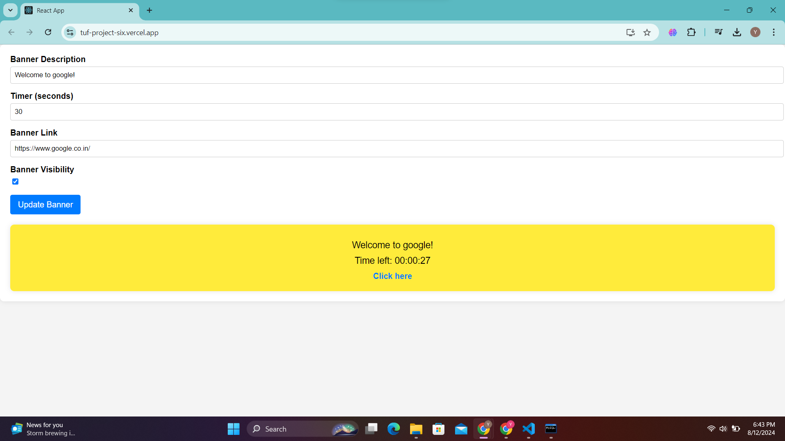

---

# Dynamic Banner Website

This project is a dynamic one-page website featuring a banner with a countdown timer. The website is built using React, Node.js, Express, and MySQL, and is fully deployed with the backend and database hosted on Render and the frontend on Vercel.

 <!-- Insert an image of the website here -->

## Table of Contents

- [Features](#features)
- [Tech Stack](#tech-stack)
- [Deployment](#deployment)
- [Installation](#installation)
- [Usage](#usage)
- [Screenshots](#screenshots)
- [Demo Video](#demo-video)
- [License](#license)
- [Contact](#contact)

## Features

- **Dynamic Banner:** A banner that can be controlled via a dashboard, including its visibility, description, countdown timer, and link.
- **Countdown Timer:** A timer that counts down and displays a message when the time is up.
- **Dashboard:** An admin dashboard to update the banner details in real-time.

## Tech Stack

- **Frontend:** React, CSS Modules
- **Backend:** Node.js, Express
- **Database:** MySQL
- **Deployment:** Render (Backend & Database), Vercel (Frontend)

## Deployment

The backend and database are deployed on [Render](https://render.com) and the frontend on [Vercel](https://vercel.com).

- **Backend URL:** [Backend on Render](https://tuf-backend-cd7i.onrender.com)
- **Frontend URL:** [Frontend on Vercel](https://your-vercel-url.vercel.app) <!-- Replace with your actual Vercel URL -->

## Installation

To set up the project locally, follow these steps:

1. **Clone the repository:**

   ```bash
   git clone https://github.com/your-username/dynamic-banner-website.git
   ```

2. **Install dependencies for the backend:**

   ```bash
   cd backend
   npm install
   ```

3. **Install dependencies for the frontend:**

   ```bash
   cd ../frontend
   npm install
   ```

4. **Set up environment variables:**

   Create a `.env` file in the `backend` directory and add the following:

   ```plaintext
   DB_HOST=your-database-host
   DB_USER=your-database-username
   DB_PASSWORD=your-database-password
   DB_NAME=your-database-name
   ```

5. **Run the backend server:**

   ```bash
   cd backend
   npm start
   ```

6. **Run the frontend:**

   ```bash
   cd ../frontend
   npm start
   ```

## Usage

Once the project is up and running, you can use the dashboard to update the banner details. The banner will automatically reflect these changes and display a countdown timer based on the time set.

## Screenshots

 <!-- Insert a screenshot of the dashboard here -->
 <!-- Insert a screenshot of the banner here -->

## Demo Video

[](#) <!-- Insert a video link here -->

## License

This project is licensed under the MIT License. See the [LICENSE](LICENSE) file for details.

## Contact

For any inquiries or feedback, feel free to reach out:

- **Email:** your-email@example.com
- **LinkedIn:** [Your LinkedIn Profile](https://www.linkedin.com/in/your-profile/)

---
